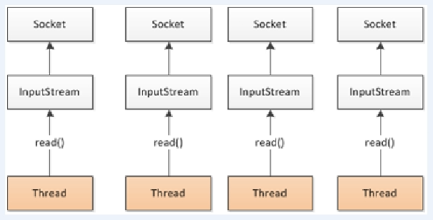
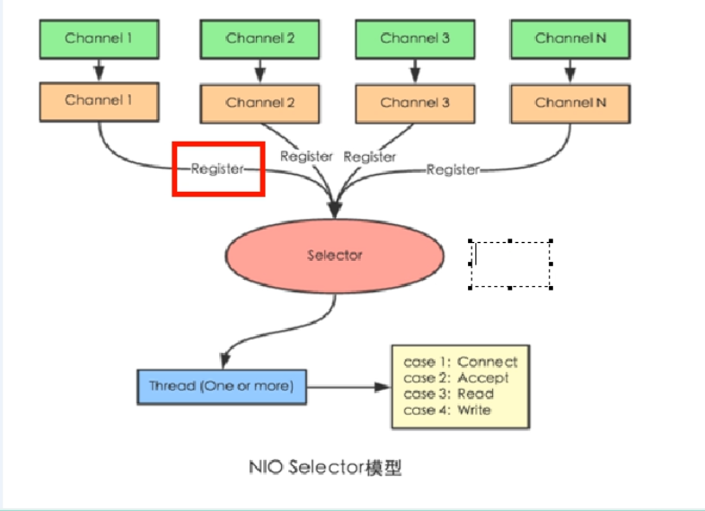

# 1. 什么是异步非阻塞？
## 1.1 同步和异步
同步和异步针对调用者，
调用者发送请求，
如果等着对方回应之后才去做其他事情就是同步，
如果发送请求之后不等着对方回应就去做其他事情就是异步。

## 1.2 阻塞和非阻塞
阻塞和非阻塞针对被调用者，
被调用者收到请求之后，
做完请求任务之后才给出反馈就是阻塞，
收到请求之后马上给出反馈然后再去做事情就是非阻塞。

# 2. 什么是响应式编程？
响应式编程是一种面向数据流和变化传播的编程范式。
这意味着可以在编程语言中方便地表达静态或动态的数据流，
而相关的模型会自动将变化的值通过数据流进行传播。
例如：在Excel中，C1的值等于A1值加B1值，
此时改变A1或B1的值，C1的值会自动变化。

# 3. 响应式编程（Reactor实现）
1. 响应式编程操作中，Reactor是满足Reactive规范
的框架。
2. Reactor有两个核心类，Mono和Flux，这两个类
实现接口Publisher，提供丰富的操作符。
   1. Flux实现发布者，返回n个元素。
   2. Mono实现发布者，返回0或1个元素。
3. Flux和Mono都是数据流的发布者，
使用Flux和Mono都可以发出三种数据信号：
   1. 元素值
   2. 错误信号
   3. 完成信号
错误信号和完成信号都代表终止信号，
终止信号用于告诉订阅者数据流结束了，
错误信号终止数据流同时把错误信息传递给订阅者。
4. 三种信号特点
   1. 错误信号和完成信号都是终止信号，不能共存。
   2. 如果没有发送任何元素值，而是直接发送错误或者
完成信号，表示是空数据流。
   3. 如果没有错误信号或完成信号，表示无限数据流。
5. 实现请看代码TestReactor.java文件
6. 调用just或者其他方法只是声明数据流，
数据流并没有发出，只有进行订阅之后才会触发数据流，
不订阅则什么都不会发生。
7. 操作符
   1. 对数据流进行一道道操作，成为操作符，如流水线。
   2. map 元素映射为新元素。
   3. flatMap 元素映射为流，把每个元素转换成流，
然后把转换之后的多个流合并成大的流。

# Spring Webflux执行流程和核心API
1. Spring Webflux基于Reactor，默认使用容器是Netty，
Netty是高性能的NIO框架，异步非阻塞的框架。
2. BIO

3. NIO

4. Spring Webflux执行过程和Spring MVC是相似的。
- Spring Webflux核心控制器是DispatchHandler，
实现接口WebHandler。
5. Spring Webflux 里面的DispatchHandler，负责
请求的处理：
- HandlerMapping：请求查询到处理的方法。
- HandlerAdapter：真正负责请求处理。
- HandlerResultHandler：响应结果处理。
6. Spring Webflux实现函数式编程有两个接口：
- RouterFunction：路由处理
- HandlerFunction：处理函数

# Spring Webflux（基于注解编程模型）
Spring Webflux实现方式有两种：
- 注解编程模型
- 函数式编程模型
使用注解编程模型方式，和之前SpringMVC使用相似，
只需要把相关依赖配置到项目中，SpringBoot
自动配置相关运行容器，默认使用Netty服务器。
## 1.创建SpringBoot工程，引入Webflux依赖。
```xml
<dependencies>
   <dependency>
      <groupId>org.springframework.boot</groupId>
      <artifactId>spring-boot-starter-webflux</artifactId>
      <version>2.5.6</version>
   </dependency>
   <dependency>
      <groupId>org.springframework.boot</groupId>
      <artifactId>spring-boot-starter-test</artifactId>
      <version>2.5.6</version>
   </dependency>
   <dependency>
      <groupId>io.projectreactor</groupId>
      <artifactId>reactor-core</artifactId>
      <version>3.4.10</version>
   </dependency>
</dependencies>
```
## 2.配置启动端口号。
## 3.创建包和相关类，实体类和Service接口
## 4.创建controller
## 5.启动服务，做测试。
- 说明SpringMVC实现方式，同步阻塞的方式，基于
SpringMVC+Servlet+Tomcat
- SpringWebflux方式实现，异步非阻塞方式，基于
SpringWebflux+Reactor+Netty

# SpringWebflux（基于函数式编程模型）
1. 在使用函数式编程模型操作时候，要自己初始化服务器。
2. 有两个核心接口：
- RouterFunction：实现路由功能，请求转发给对应
handler。
- HandlerFunction：处理请求，生成响应函数。
3. 核心任务：定义两个函数式接口的实现并且启动服务器。
4. SpringWebflux请求和响应不再是ServletRequest和
ServletResponse。
而是ServerRequest和ServerResponse。
## 1. 把注解编程模型工程复制一份
## 2. 创建Handler（具体实现方法）
## 3. 初始化服务器，编写Router
- 创建路由
- 创建服务器完成适配
- 最终调用
## 4. 使用WebClient调用
